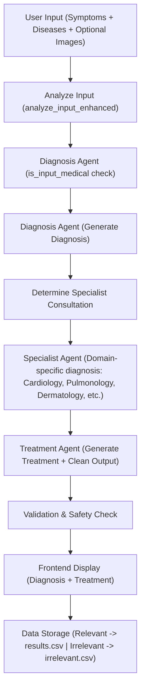

# 🩺 MedInsight AI Assistant

**MedInsight AI Assistant** is an **AI-powered medical insight platform** that combines **large language models (LLMs)** with an **agentic workflow** to provide:  

-  **Symptom-based diagnosis**  
-  **Treatment suggestions**  
-  **Specialist consultation simulation** (Cardiology, Pulmonology, Dermatology, etc.)  
-  **Optional medical report generation** (with export functionality)  
-  **Chatbot for medical Q&A**  

This project leverages the **MedExpert** model, built on top of:  
- [`ruslanmv/Medical-Llama3-8B`](https://huggingface.co/ruslanmv/Medical-Llama3-8B)  
- [`m42-health/Llama3-Med42-8B`](https://huggingface.co/m42-health/Llama3-Med42-8B)  

The chatbot also uses the hosted MedExpert model:  
> [MedExpert on Ollama](https://ollama.com/OussamaELALLAM/MedExpert)  

⚠️ **Disclaimer**: This project is for **educational and informational purposes only**.  
It is **not a substitute for professional medical advice, diagnosis, or treatment.**  

---

##  Demo

---

## Agentic Workflow (Pipeline)
The project is powered by an **orchestrator + specialized agents** system that coordinates diagnosis, treatment, and consultation. 

## Agents and Components
  1. Orchestrator Agent:
      - Core controller that coordinates workflow.
      - Calls agents in sequence:
        - Diagnosis Agent
        - Specialist Agent
        - Treatment Agent
      - Validates final outputs, checks safety, and formats responses

  2. Diagnosis Agent:
     - Uses MedExpert (LLM-based)
     - Steps:
         - Calls is_input_medical(model, symptoms) → ensures medical relevance
         - If relevant → generate_diagnosis(model, symptoms) produces initial diagnosis
      
  3. Specialist Agent:
     - Routes input to the correct specialty class based on keywords:
       - Cardiology
       - Pulmonology
       -  Dermatology
       -  … (extendable for more fields)
     - Each specialist agent:
       - Uses domain-specific prompts
       - Generates refined diagnosis + recommendations
      
  4. Treatment Agent:
     - Input: (diagnosis + symptoms + model)
     - Calls generate_treatment() with a treatment-focused prompt
     - Calls clean_model_output() → ensures output is structured and readable
     - Orchestrator then validates safety (alerts for critical cases)
    
  5. Data Storage:
     - Relevant results → stored in relevant_cases.csv
     - Irrelevant cases → stored in irrelevant_cases.csv
    
  6. Chatbot:
     - General Q&A system for medical questions
     - Uses MedExpert (Ollama-hosted model)
     - Friendly but cautious:
         - If non-medical → gives vague/polite responses
         - If medical → provides concise, relevant info.
       - Generates refined diagnosis + recommendations.
      
  7. Medical Report with export functionality

## Installation & Setup
1. Clone repository:
    - git clone https://github.com/USERNAME/MedInsight-AI-Assistant.git
    - cd MedInsight-AI-Assistant
2. Backend setup:
    - cd backend
    - python -m venv venv
    - source venv/bin/activate   # Windows: venv\Scripts\activate
    - pip install -r requirements.txt
    - python routes.py
3. Frontend setup:
    - In your termianl run:
        - python backend/main.py

## Future Improvements
- Voice input & TTS output
- Multi-language support
- Integration with PubMed / real-time medical knowledge
-  Mobile app version

## Contributing
Contributions are welcome!
  1. Fork the repo
  2. Create a branch: git checkout -b feature/your-feature
  3. Commit changes: git commit -m "Add new feature"
  4. Push branch: git push origin feature/your-feature
  5. Open a Pull Request 🎉
     
## Authors

Zara Zaman – Project Lead & Developer
